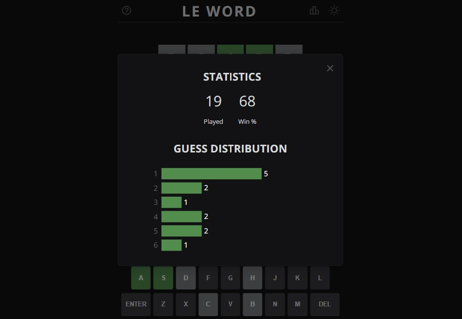

# Le Word - A Wordle Clone

A wordle clone that uses APIs to pull random words and check spelling. See live [here](https://leword.netlify.app/).

## Game Instructions

- Guess the WORD in 6 tries.
- Each guess must be a valid 5 letter word. Press the enter button to submit.
- After each guess, the color of the tiles will change to show how close your guess was to the word (see help modal for examples).
- Refresh the page for a new word.

_Example of Le Word being played in dark mode._

_Instructions/help modal._

_Statistics modal._

_Example of Le Word being played in light mode._

## Make It Your Own

1. Clone or download the repository (you should have [Node.js](https://nodejs.org/en/) installed already).
2. In Context.js, enter a new default Solution in the useState hook on line 64.
3. Subscribe to the [Bing Spell Check](https://rapidapi.com/microsoft-azure-org-microsoft-cognitive-services/api/bing-spell-check2/) API and the [Random Words](https://rapidapi.com/sheharyar566/api/random-words5/) API.
4. Create a .env file as shown in the .env_sample file.
5. Replace the API Keys with your own.
6. Launch and Enjoy!

## Credits

- The original version of this game is [Wordle](https://www.nytimes.com/games/wordle/index.html). Credit to the original creator Josh Wardle.
- [Bing Spell Check](https://rapidapi.com/microsoft-azure-org-microsoft-cognitive-services/api/bing-spell-check2/) API
- [Random Words](https://rapidapi.com/sheharyar566/api/random-words5/) API
- Created with [Create React App](https://github.com/facebook/create-react-app)
